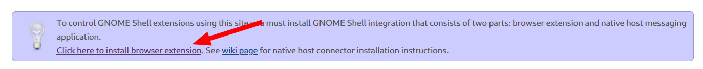
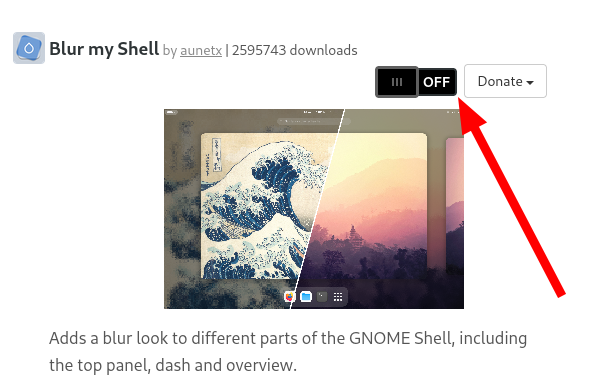

# debian-ujcv-assets
UJCV Debian distro assets and configuration files.  
This also serves as a guide to build the distro from vanilla Debian 12 Bookworm (GNOME Live ISO recommended).

The default password is `2024`.

## Packages to be installed manually:
- wget
- git
- papirus-icon-theme
- adw-gtk3
- python3
- bleachbit
- python3-tk
- gnome-tweaks
- ttf-mscorefonts-installer
- cmus
- gdu
- timeshift
- dconf-editor
- htop
- celluloid
- rar
- unrar
- firejail
- gparted
- gnome-disk-utility
- speedtest

But first:
```bash
sudo apt-add-repository contrib non-free -y
```
then:

```bash
sudo apt update && sudo apt upgrade
```

Append the follwing line to `~/.bashrc`:  
```bash
# Fix PATH
PATH=$PATH:/home/pi/bin:/usr/local/sbin:/usr/sbin:/sbin:/home/pi/.local/bin:
```

Command:
```sh
sudo apt install wget git papirus-icon-theme python3 bleachbit python3-tk gnome-tweaks ttf-mscorefonts-installer cmus gdu timeshift dconf-editor htop celluloid rar unrar firejail gparted gnome-disk-utility speedtest-cli
```

Finally, install the provided `.deb` packages from the `deb packages` directory:

```bash
cd deb\ packages/
```

```bash
sudo dpkg -i *
```

```bash
sudo apt -f install
```

### Firefox Replacement

Replace Firefox-ESR with Firefox (non ESR) using the following commands:
```bash
sudo install -d -m 0755 /etc/apt/keyrings 
```

```bash
wget -q https://packages.mozilla.org/apt/repo-signing-key.gpg -O- | sudo tee /etc/apt/keyrings/packages.mozilla.org.asc > /dev/null
```

```bash
gpg -n -q --import --import-options import-show /etc/apt/keyrings/packages.mozilla.org.asc | awk '/pub/{getline; gsub(/^ +| +$/,""); if($0 == "35BAA0B33E9EB396F59CA838C0BA5CE6DC6315A3") print "\nThe key fingerprint matches ("$0").\n"; else print "\nVerification failed: the fingerprint ("$0") does not match the expected one.\n"}'
```

```bash
echo "deb [signed-by=/etc/apt/keyrings/packages.mozilla.org.asc] https://packages.mozilla.org/apt mozilla main" | sudo tee -a /etc/apt/sources.list.d/mozilla.list > /dev/null
```

```bash
echo '
Package: *
Pin: origin packages.mozilla.org
Pin-Priority: 1000
' | sudo tee /etc/apt/preferences.d/mozilla 
```

```bash
sudo apt remove firefox-esr
```

```bash
sudo apt-get update && sudo apt-get install firefox
```

### Pipewire Replacement
Completely replace PulseAudio with the more modern Pipewire using the following commands:

```bash
sudo apt install wireplumber pipewire-media-session-
```

```bash
systemctl --user --now enable wireplumber.service
```

```bash
sudo apt install pipewire-pulse pipewire-alsa pipewire-jack
```

Then reboot

## Enable Flatpak
```bash
sudo apt install flatpak
```

```bash
sudo apt install gnome-software-plugin-flatpak
```

```bash
flatpak remote-add --if-not-exists flathub https://dl.flathub.org/repo/flathub.flatpakrepo
```

Then restart

### Flatpak Apps Installation:
The following flatpak apps are installed:
- Flatseal
- Video Downloader
- MissionCenter
- MarkText

```bash
flatpak install com.github.tchx84.Flatseal com.github.unrud.VideoDownloader io.missioncenter.MissionCenter com.github.marktext.marktext
```

# Customization
This is a heavily opinionated and customized GNOME setup. Some of the customizations include:

## Extensions
- Caffeine
- Pano (requires some extra setup)
- Dash to Dock / Dash to Panel (choose on or the other)
- Desktop Icons ng Gtk4
- Removable Drive Menu
- User Themes
- QSTweak
- Status Area Horizontal Spacing
- AppIndicator and KStatusNotifierItem Support (alternatively, you could use Tray Icons: Reloaded)
- Expandable Notifications
- Vitals
- No overview at startup
- Blur my shell
- Rounded Windows Corners
- Alphabetical App Grid
- Logo Menu
- Apps Menu
- Emoji Selector
- Places Status Indicator
- Color Picker

These can be fetched from https://extensions.gnome.org/. Since no UUID is provided at the time of the making of this distro, it cannot be automated via `gnome-extensions`.

To install extensions from the website, you will have to first install a Firefox extension that will appear in a card at the top of the website when you first visit it.


Then you can install the extensions by searching them and clicking the off/on switch.


Repeat until you installed all the extensions listed above.

#### Important: For 'Pano' to work you will need to install the following packages:
```bash
sudo apt install gir1.2-gda-5.0 gir1.2-gsound-1.0
```

### Extensions Configuration:
This can all be done within the "Extensions" app.
- Change Pano shortcut to Super+V (for this you will need to disable a system shortcut first)
- Make Status Area Horizontal Spacing's spacing smaller
- Change Logo Menu to use an icon of your liking, in this case we use the monochrome Debian icon.


## Shortcuts
- Set `gnome-terminal` to launch with shortcut: `Ctrl + Alt + T`

## Tweaks Configuration
Open gnome-tweaks and change the following settings:
- Add day of the week on top panel
- Add minimize and maximize buttons to windows
- Change touchpad to "Area"
- Enable window resizing with secondary button

## GRUB configuration
Place `bg-ujcv.png` from `system-assets` in `/boot/grub/`


Append the following line to `/etc/default/grub`
```sh
GRUB_BACKGROUND="/boot/grub/bg-ujcv.png"
```

And lastly, run:
```bash
sudo update-grub
```

Reboot to see the changes.

## GDM Greeter Logo
First, place `distributor-logo.png` from `system-assets` in `/usr/share/pixmaps/logo/`

Then, create the gdm profile which contains the following lines:  

`/etc/dconf/profile/gdm`

```bash
user-db:user
system-db:gdm
file-db:/usr/share/gdm/greeter-dconf-defaults
```

Alternatively, just copy the `gdm` file provided in the repo.

---

"gdm" is the name of a dconf database.

Create a gdm database for machine-wide settings in `/etc/dconf/db/gdm.d/01-logo`:

```bash
[org/gnome/login-screen]
logo='/usr/share/pixmaps/logo/distributor-logo.png'
```

Finally, run:
```bash
sudo dconf update
```

Reboot to see the changes.

## GDM Background Image

To do so manually (ie. you want to put your own background image), follow the guide at the [The Arch Linux Wiki](https://wiki.archlinux.org/title/GDM#Login_screen_background_image).

To simplify the process, we provide the `gnome-shell-theme.gresource` inside `system-assets` already precompiled. It has the image blurred by default, if you want to use the original, unblurred image use `unblurred-gnome-shell-theme.gresource` instead. Just make sure to rename it back to the original name.

The step to apply the gresource is straightforward, just replace `/usr/share/gnome-shell/gnome-shell-theme.gresource` with the one provided by us.

To see the changes, **reboot**, a simple log-out will not do.

## User Customization
Now we need to change a few user settings to match the system branding.

1. Change the profile picture to `user.png` from the `system-assets` folder.
2. Change the desktop wallpaper to `wallpaper.jpg` also from the `system-assets` folder.

## Themes
We provide a few themes to increase the visual appeal of the system:
- **adw-gtk3**: For the default, vanilla gnome-ish look. Includes, brand-new support for gtk2 themes too.
- **WhiteSur-gtk-theme**: For MacOS enthusiasts.
- **Colloid-gtk-theme**: The main theme of this project, a selection of different palettes with a modern look.

These themes also include scripts to help the user customize their system. For example, the `Colloid-gtk-theme` includes a helper script to change the accent color, color palette and several other tweaks.

Since, `Colloid-gtk-theme` os the main theme of the project, we will use it as an example. To apply it, head over to the `repos/Colloid-gtk-theme` folder and run the `helper.sh` script using:

```bash
chmod +x helper.sh && ./helper.sh
```

Next, enter the accent color, dark/light mode and the tweaks. For the tweaks, we recommend `catppuccin rimless black`.

With this, the theme has been installed properly.

Now to apply it, run `./gui-libadwaita-tc.py` from the `scripts` folder and select the theme and hit apply. This will ensure it applies to both gtk3 and gtk4 applications.

In case the gtk3 theme does not apply, you can manually do so from `gnome-tweaks`.

You also need to manually change the shell-theme, you can do so from `gnome-tweaks` or using the `user-themes` extension.

### Flatpak Integration
By default, flatpak ignores the set theme, to address this issue we must run the following commands:

```bash
sudo flatpak override --filesystem=xdg-config/gtk-3.0:ro
```

```bash
sudo flatpak override --filesystem=xdg-config/gtk-4.0:ro
```

```bash
sudo flatpak override --filesystem=~/.themes
```

```bash
sudo flatpak override --filesystem=~/.local/share/themes
```

With this, the themeing should work properly for both GTK2/3/4 and flatpak applications.